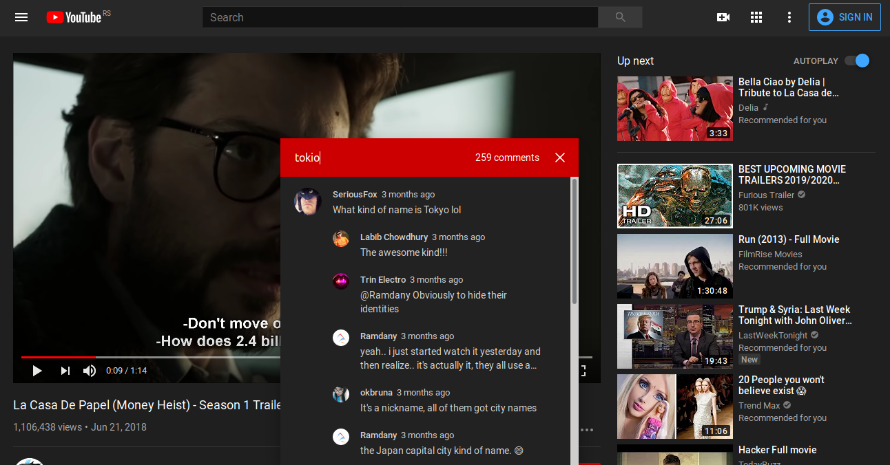

# Firefox extension for YouTube comments search 

Simple plugin for searching YouTube video comments by keywords.



## Installation
Currently only way to install plugin is thought building from source code and importing into browser as temporary add-on. <br>
:warning: Keep in mind that extension will be removed when browser is restarted.

#### Requirements
- Node.js >= 8 and npm >= 5
- [git](https://git-scm.com)

#### Build

```bash
$ git clone https://github.com/pancevac/firefox-ytsc-extension.git
$ cd firefox-ytsc-extension
$ npm install
$ npm run build
```

### `npm run build`

Build the extension into `dist` folder for **production**.

### `npm run build:dev`

Build the extension into `dist` folder for **development**.

### `npm run watch`

Watch for modifications then run `npm run build`.

### `npm run watch:dev`

Watch for modifications then run `npm run build:dev`.

It also enable [Hot Module Reloading](https://webpack.js.org/concepts/hot-module-replacement), 
which also work on firefox, but after you temporary load plugin into browser.

### Temporary loading
https://extensionworkshop.com/documentation/develop/temporary-installation-in-firefox/


